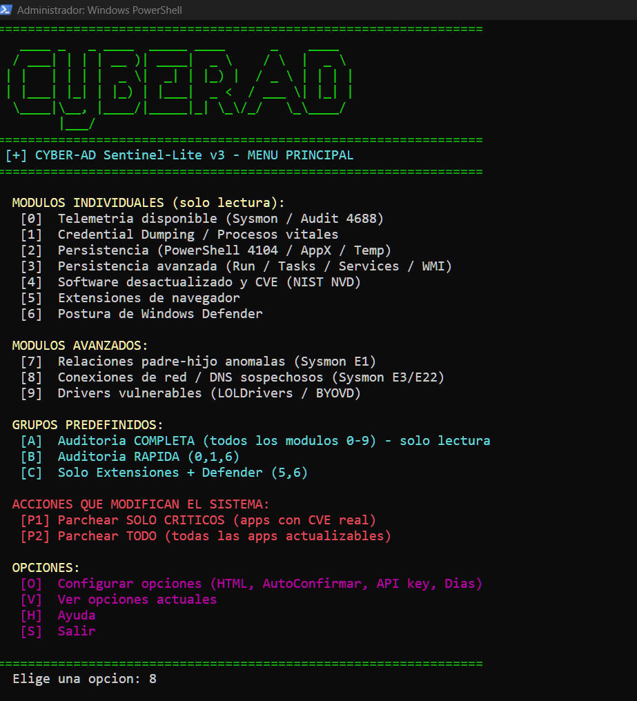
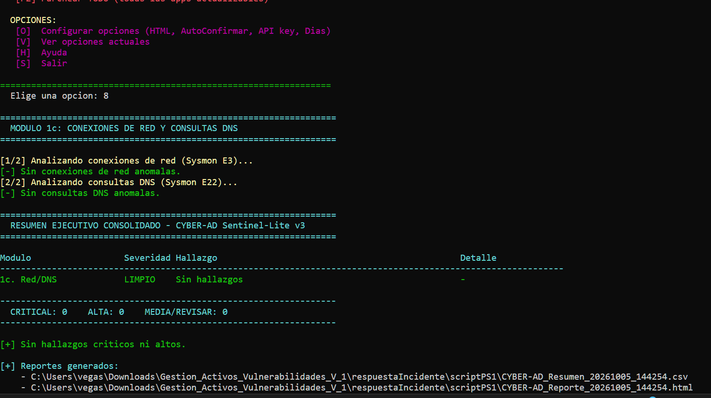
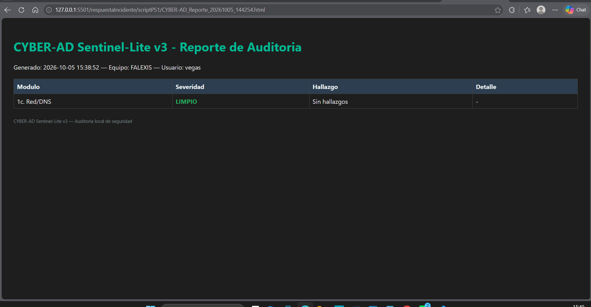
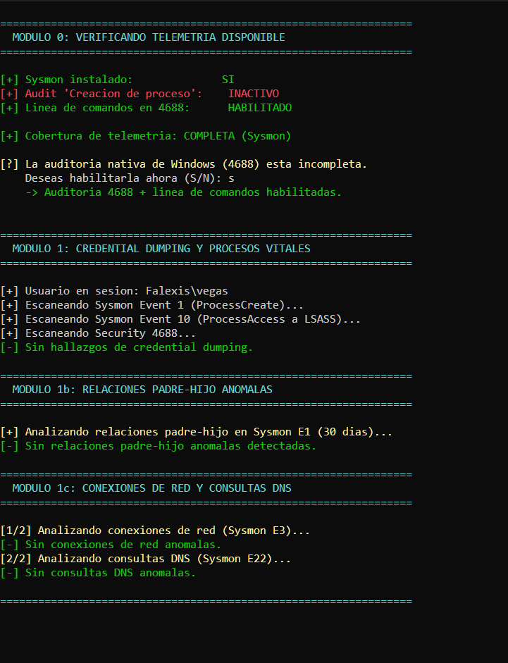
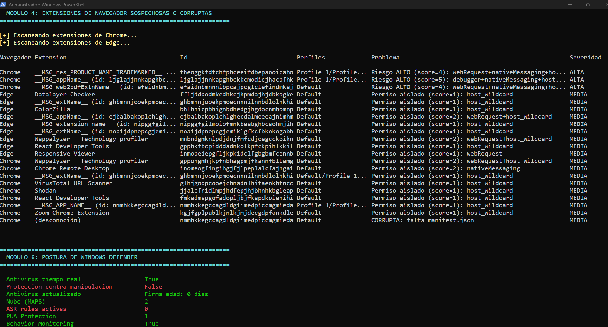
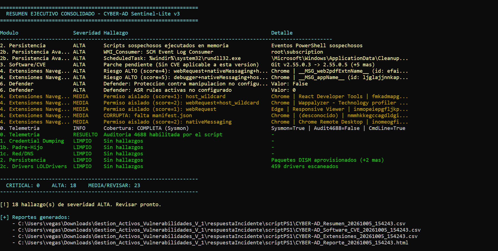
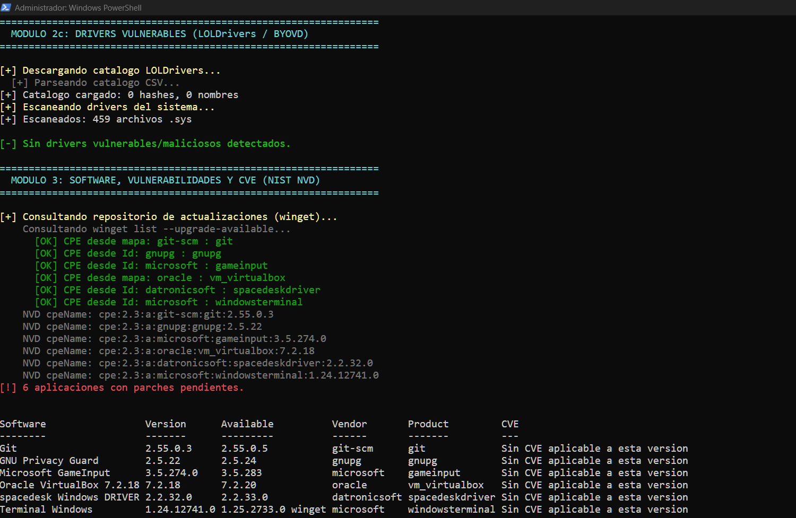
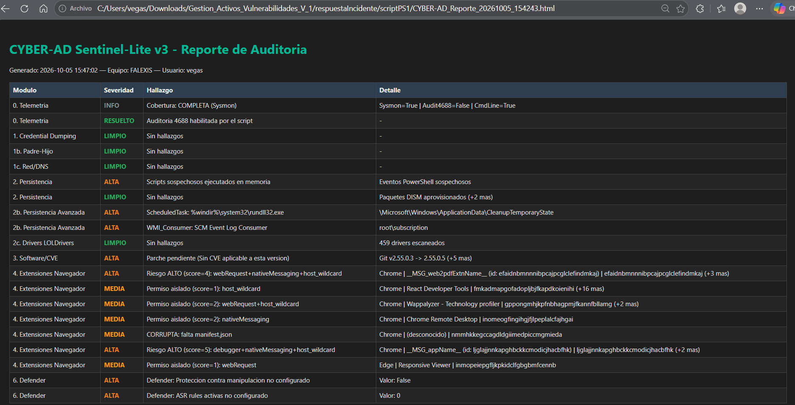

# 🛡️ CYBER-AD Sentinel-Lite v3

**CYBER-AD Sentinel-Lite v3** es una herramienta integral de auditoría de seguridad y análisis de amenazas para sistemas Windows escrita en PowerShell. Está diseñada específicamente como un sustituto manual de consultas KQL de Microsoft Sentinel o Defender para endpoints y servidores Windows que no cuentan con un EDR/XDR desplegado. 

Permite centralizar inspecciones profundas del sistema, mapear telemetría forense y aplicar parches de vulnerabilidades de manera interactiva o automatizada a través de la CLI.

<!-- ZONA GIF / IMAGEN: Animación corta mostrando el menú principal iniciando -->


---

## ✨ Características Principales

*   **Auditoría Local Avanzada:** Sustituye la necesidad de agentes complejos ejecutando reglas de detección directamente sobre registros de eventos locales.
*   **Enriquecimiento con NIST NVD:** Consulta de forma automatizada las vulnerabilidades (CVE) del software desactualizado en la base de datos oficial del NIST.
*   **Gestión Legal Segura (MIT):** Protegido por una licencia permisiva que te blinda ante responsabilidades y permite el uso corporativo.
*   **Modo Dual:** Menú interactivo visual por consola o ejecución 100% automatizada por línea de comandos (CLI) ideal para scripts de despliegue.

---

## 📊 Módulos Incluidos

El script cuenta con una arquitectura modular dividida de la siguiente manera:

### 🔍 Módulos Individuales y Avanzados (Solo Lectura)
*   **[0] Telemetría disponible:** Detecta el estado de Sysmon y la directiva de auditoría nativa 4688 (Línea de comandos), ofreciendo su auto-instalación.
*   **[1] Credential Dumping:** Inspección de procesos vitales y accesos anómalos a LSASS (Procdump, comsvcs.dll, Mimikatz).
*   **[1b] Relaciones padre-hijo anómalas:** Detección de ejecuciones sospechosas (ej. `cmd.exe` nacido desde servidores web).
*   **[1c] Conexiones de red / DNS sospechosos:** Filtrado de eventos Sysmon E3 y E22 contra patrones de tráfico anómalos.
*   **[2] Persistencia Básica:** Escaneo de logs de PowerShell (4104), paquetes AppX/DISM sospechosos y binarios en directorios temporales (`Temp`).
*   **[2b] Persistencia Avanzada:** Auditoría profunda de llaves de registro `Run`, Tareas Programadas, Servicios de Windows y suscripciones WMI.
*   **[2c] Drivers vulnerables:** Contraste de controladores cargados contra la base de datos de **LOLDrivers / BYOVD**.
*   **[3] Software desactualizado y CVE:** Mapeo de inventario a través de `winget` cruzando identificadores CPE con la API de NIST NVD.
*   **[4] Extensiones de navegador:** Análisis de extensiones instaladas en Chrome, Edge y Brave buscando permisos abusivos o corrupción.
*   **[6] Postura de Windows Defender:** Estado de salud general del antivirus nativo y configuraciones de mitigación.

### 🛠️ Acciones de Modificación de Sistema
*   **[P1 / P2] Parcheo de Aplicaciones:** Creación automática de puntos de restauración del sistema y actualización masiva de software obsoleto mediante `winget`.

---

## 📸 Demostración de Uso

### Análisis Forense de Red y DNS (Módulo 1c / Módulo 8)
Visualización del análisis de tráfico y su respectiva correlación de datos en la herramienta:


*Consola interactiva interceptando telemetría de red.*


*Estructura de almacenamiento de registros analizados.*

---

## 🚀 Instalación y Uso Rápido

### Requisitos Previos
*   Windows 10 / 11 o Windows Server 2016 en adelante.
*   Ejecutar la consola de PowerShell como **Administrador**.

### Modo Interactivo (Menú)
Para desplegar el banner ASCII y gestionar los módulos de forma manual:
```powershell
.\CYBER-AD-SentinelLite3.ps1
```

### Modo CLI Automático (Sin Menú)
Ideal para auditorías automatizadas sin intervención del usuario:
```powershell
# Ejecutar absolutamente todos los módulos y exportar resultados a HTML
.\CYBER-AD-SentinelLite3.ps1 -Modulos Todos -ExportarHtml

# Ejecutar únicamente la auditoría de extensiones y Windows Defender
.\CYBER-AD-SentinelLite3.ps1 -Modulos Extensiones,Defender
```

---

## 🔍 ¿Cómo Interpretar los Resultados? (Caso Real de Uso)

Cuando ejecutas la **Auditoría COMPLETA (Opción A)**, el script analiza el sistema por capas. A continuación se detalla qué significan los hallazgos críticos detectados en el escaneo:

### 📡 1. Telemetría y Línea de Comandos (Módulo 0)
El script valida si tu sistema registra correctamente los eventos de seguridad esenciales:
*   Si la **Auditoría nativa 4688** está incompleta o inactiva (no registra las líneas de comando de lo que se ejecuta), el script te ofrecerá solucionarlo al instante pulsando `S`.

### 🛡️ 2. Persistencia y Amenazas de Severidad Alta (Módulos 2 y 2b)
El motor de detección clasifica los riesgos para que sepas qué priorizar:

| Componente | Hallazgo / Ubicación | Severidad | Diagnóstico Técnico |
| :--- | :--- | :---: | :--- |
| **PowerShell 4104** | Ejecución de bloques de código | `[!] DETECTADO` | Scripts sospechosos o fuertemente ofuscados ejecutados directamente en memoria. |
| **Scheduled Task** | `\Microsoft\Windows\ApplicationData\CleanupTemporaryState` | 🔴 **ALTA** | Tarea programada anómala que invoca a `%windir%\system32\rundll32.exe`. |
| **WMI Consumer** | `root\subscription` -> `SCM Event Log Consumer` | 🔴 **ALTA** | Persistencia avanzada a través de suscripciones de eventos WMI que evaden el inicio tradicional. |

### 🌐 3. Auditoría de Extensiones (Módulo 4)
Monitorea los navegadores buscando tácticas de espionaje o secuestro de datos basados en un sistema de puntaje (*Score*):
*   🔴 **Severidad ALTA (Scores 4 y 5):** Extensiones en Chrome/Edge combinando permisos de alto riesgo como `webRequest + nativeMessaging + host_wildcard` o `debugger`. Esto significa que la extensión puede interceptar tráfico de red sensible o interactuar de forma nativa con binarios locales del sistema operativo.

---

## 📈 Demostración Visual de la Consola

Así es como luce la interfaz interactiva durante un análisis completo cuando intercepta vectores de ataque activos en un equipo:



---

## 📄 Formato del Reporte HTML Generado
Al finalizar el análisis del menú o la CLI, se compila un archivo interactivo independiente `CYBER-AD_Report_*.html`. Este reporte estructurado cuenta con la siguiente interfaz interactiva:

*   **Navegación e Historial de Ejecución:** Panel lateral intuitivo para saltar entre módulos analizados.
    

*   **Resumen Ejecutivo:** Una vista gráfica y rápida diseñada para mostrar el estado global de salud a la gerencia o clientes.
    

*   **Análisis de Vulnerabilidades:** Lista detallada de software desactualizado cruzado dinámicamente con sus respectivos identificadores de riesgo.
    

*   **Diseño Responsivo:** Reportes limpios visualizables desde cualquier navegador corporativo.
    

---

## 📄 Licencia

Este proyecto está bajo la **Licencia MIT**. Esto significa que puedes usarlo, modificarlo y distribuirlo de forma comercial o privada de manera completamente gratuita. Consulta el archivo [LICENSE](LICENSE) para ver los términos de exención de responsabilidad detallados.
